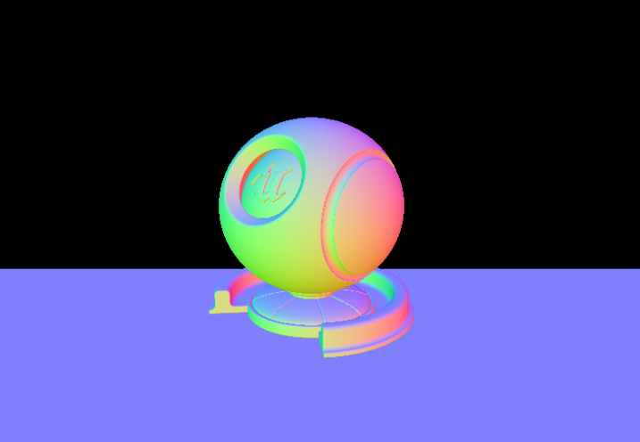

# YoungL Learn Project of DX12

## Hierarchy of RenderCore

- RenderCore
  - WinApp
  - GameCore
  - GameTimer
  - Camera
  - MeshActor
  - Render
  - ShadowMap
  - RenderThread
  - RenderThreadManager
  - RHIDepthResource
    - RHIContext
    - RHIResource
    - RHIResourceHandle
    - RHI
    - D3D12
      - d3dx12.h
      - RHIResource_D3D12
      - RHIDepthResource_D3D12
      - RHIContext_D3D12
      - RHIVertextBuffer_D3D12
      - RHIIndexBuffer_D3D12
      - RHIShaderResource_D3D12
      - RHIConstantBuffer_D3D12
      - RHIResourceHandle_D3D12
      - RHIUploadBuffer_D3D12
      - RHIRenderingItem_D3D12
      - RHIGraphicsPipelineState_D3D12
  - Shaders
    - Common.hlsli
    - BasepassRS.hlsli
    - Lighting.hlsli
    - BasepassVS.hlsl
    - BasepassPS.hlsl
    - DepthRS.hlsli
    - DepthVS.hlsl
    - DepthPS.hlsl
  - Models
    - ModelSave.Bin
    - ModelFloor.Bin

## RenderCore: DX12 Course work
- version 0.0: basic process for drawing objects
- version 0.1: basic blinn-phong(from Introduction to 3D Game Programming with DirectX12)
- version 0.2: basic render core rhi framework
- version 0.3: Add RenderThread
- version 0.4: Add ReaderThreadManager and RenderCommand
- version 0.5: Add Camera Control
- version 0.6: Memory Release
- version 0.7: Realtime Shadow

## EngineCore:Expermental framework for rhi
- version 0: application interface(WINAPI relative)
- version 1: GPU Resrouce && Buffer
- version 2: command context(not completed yet)
